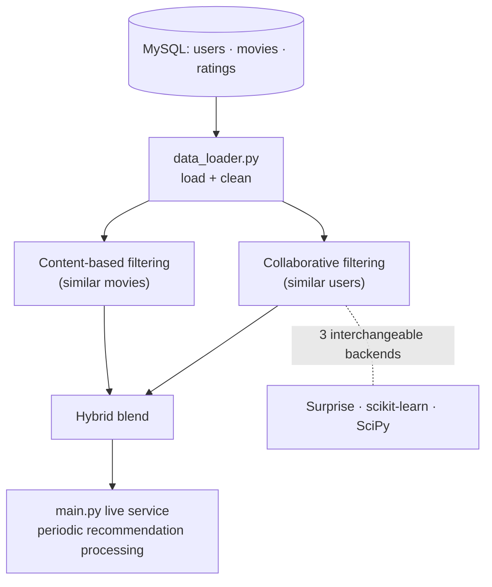

<div align="center">

# Hybrid Movie Recommender System

### Collaborative + content-based filtering, implemented three ways

[](https://python.org)
[](https://scikit-learn.org)
[](https://surpriselib.com)
[](https://mysql.com)

**A hybrid recommender that blends "what did similar users watch?" with "what are similar movies?" — and ships the collaborative engine in three separate implementations to compare abstraction vs. control.**

</div>

---

## Design



## Three Implementations, One Interface

| Version | Library | Abstraction | Best For |
|---|---|---|---|
| Surprise | specialized recommender lib | very high (black box) | rapid prototyping, algorithm comparison |
| scikit-learn | general-purpose ML | medium | integrating into a larger ML system |
| SciPy | low-level scientific | very low (full control) | custom systems needing fine-grained control |

Selectable at runtime: `python main.py --version {sklearn|scipy|surprise}`.

---

## Structure

```
hybrid-movie-recommender/
├── src/
│   ├── database_manager.py         # DB connection
│   ├── data_loader.py              # load + clean
│   ├── model_builder{,_scipy,_surprise}.py
│   └── recommender{,_scipy,_surprise}.py
├── data/db_schema.sql              # MySQL schema
├── demo.ipynb                      # interactive demo
├── generate_dummy_data.py
└── main.py                         # live service entry point
```

## Setup

```bash
git clone https://github.com/YazanAi-Dev3/hybrid-movie-recommender.git
cd hybrid-movie-recommender

mysql -u <user> -p movie_recommender_db < data/db_schema.sql
cp .env.example .env      # DB credentials
pip install -r requirements.txt
python generate_dummy_data.py   # optional: populate with fake data
python main.py                  # default (sklearn)
```

## Tech Stack

`Python` · `scikit-learn` · `Surprise` · `SciPy` · `MySQL` · `Pandas`

## License

MIT — see [LICENSE](LICENSE).
